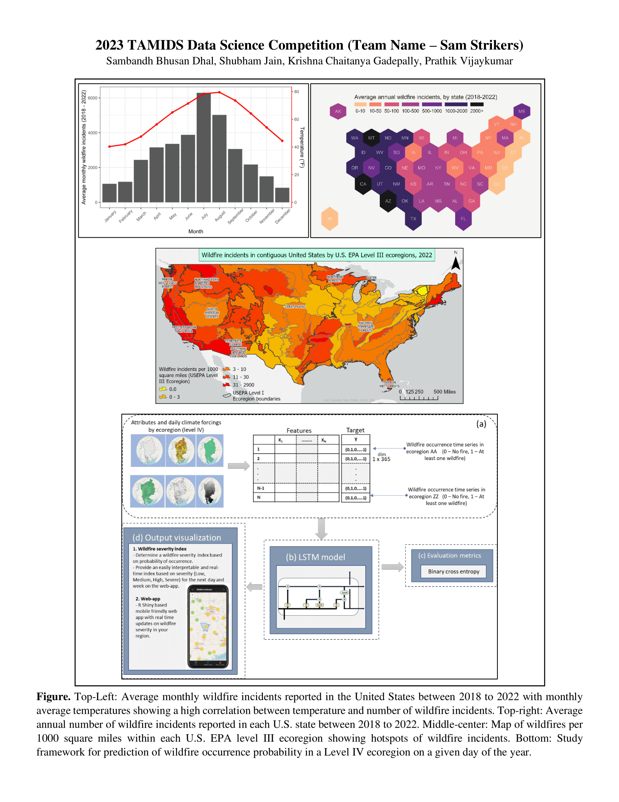

# Objective
This paper is about predicting large wildfires in the Contiguous United States using deep neural networks. It examines the severity of large wildfires across the United States over the past decade (2011-2020) using a wide array of meteorological, land cover, and topographical features in the Deep Neural Network model. The goal is to understand the factors influencing the occurrence and severity of wildfires and facilitate wildfire management and policies

## Poster

# 2023-TAMIDS-Competition-Data
Datasets and Executable codes for 2023 TAMIDS Data Science Competition (Team - Sam's Strikers) 

### Awarded 3rd place in the graduate competition.
### Best supplementary materials award.
### Best mid-point visualization award. 

# Folder Structure - 
1. <strong>R</strong> - Codes for initial data analysis and preparation. Downloading and cleaning remote sensing datasets, and plotting figures.
2. <strong>shiny-app</strong> - R code for shiny web application https://shubhamjain.shinyapps.io/Wildfires/ 
3. <strong>Plots</strong> - saves png files for plots in report 
4. <strong>GIS_data</strong> - geodatabase for GIS data used in analysis and arcpro map project files for map preparation 
5. <strong>DNN_model</strong> - Executable Python notebook to run Deep Neural Network (DNN) model 
6. <strong>wildfires_data.csv </strong> - Dataset prepared for DNN model
7. <strong>TAMIDS_2023_SAMS_STRIKERS.pdf</strong> - Final Report 
 
